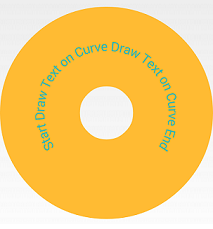

# Android RingButton sample app

## About
Button in the form of ring

## Example

## Technical description
- default outer diameter is determined by layout - match_parent
- outer diameter can be changed via own attribute externalDiameter
- default inner diameter is 25% of outer diameter
- inner diameter can be changed via own attribute internalDiameter
- there is a custom text in the center of the ring (along the circle
with an averaged radius) symmetrically to vertical axis
- style of custom text can be changed via attribute textAppearance
- there is transparent area in the center of the ring (circle with inner diameter)
- button color can be changed via own attribute ringBackgroundColor
- button (the whole area, including transparent) responds to pressing
(inversion of color - the text takes the background color and the background takes the text color)
- text font: Roboto
- app is working starting from API LEVEL 10
- app is build using Gradle + obfuscation with ProGuard